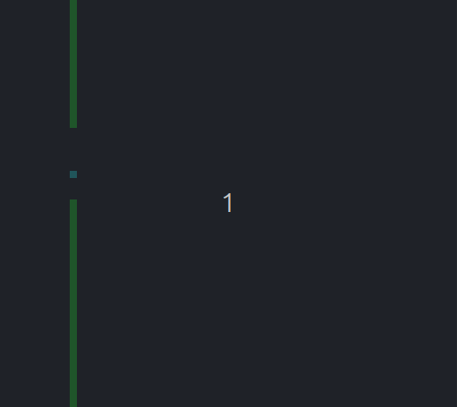

# LC-3 Virtual Machine and Assembly Game

This projects describes a ully functional, custom-built LC-3 (Little Computer 3) Virtual Machine 
written in C, running a real-time graphical game programmed entirely in bare-metal LC-3 Assembly.

It bridges the gap between low-level hardware architecture and software execution, bypassing modern 
abstractions to demonstrate how raw memory manipulation, CPU cycles and memory-mapped I/O translate 
into a playable game.



## Architecture Overview

The system relies heavily on Memory Interfacing. The Assembly code does not use standard output. 
Instead, it directly modifies a dedicated section of memory (Video RAM starting at 0xC000). The C 
emulator acts as the GPU, continuously reading the VRAM, transforming the 16-bit values into RGB 
pixels and rendering them via SDL2, all running sequentially in a highly optimized loop.

## Features

### The LC-3 Emulator
* **CPU Simulation** Implements the complete fetch-decode-execute cycle, handling 16-bit 
instructions, registers, condition flags, and Trap routines.
* **Memory-Mapped I/O** Custom memory addresses act as hardware interfaces for keyboard input 
(`0xFE00`, `0xFE02`), random number generation (`0xFE04`), and VRAM (`0xC000`).
* **Hardware V-Sync** The emulator synchronizes the SDL2 rendering loop with the Assembly game loop 
to ensure 60 FPS gameplay sequentially.

### "Flappy Pixel" Game
* **Custom Physics & Collisions:** Implements gravity, jump physics and pixel-perfect collision 
detection with the floor, ceiling and obstacles.
* **Procedural Generation:** Walls and gaps are dynamically generated using a custom hardware RNG 
interface.
* **Memory Interfacing:** The game logic calculates the score and writes it to a specific memory 
address (`0x4000`), which the C emulator constantly monitors and displays in the window title.

## How to play

You need a C compiler (`gcc`), `make`, and the SDL2 development libraries installed on your Linux 
system.

```bash
sudo apt-get install gcc make libsdl2-dev
```

### Build & Run

The project includes a unified Makefile that compiles both the C emulator and the Assembly game,
and launches them automatically.
* **make** for compiling the C emulator
* **make asm** for compiling the game and obtaining the obj file
* **make play** for playing the game

### Controls

* *[W]* jumping
* gravity pulls the pixel down automatically
* avoid the green walls and the screen borders